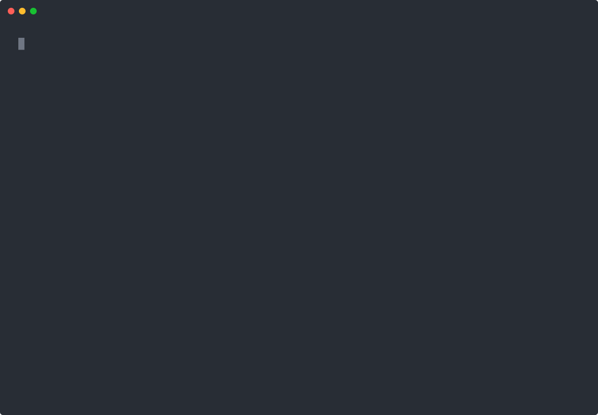

<div align="center">



# bruine

**A coding agent for your terminal that runs your own models.**

*bruine* (French, /bʁɥin/): a fine, steady rain.

[](LICENSE)
[](https://nodejs.org)


</div>

Point bruine at a llama.cpp server on your machine, at any cloud provider (DeepSeek, Anthropic,
OpenAI, Google, OpenRouter, Groq, Mistral, xAI and about twenty more), or at anything that speaks
the OpenAI-compatible `/v1` API. It reads and edits your code, runs your commands, and asks before
anything risky. There is no account, and nothing is sent anywhere you did not point it at.

```
npm install -g bruine
bruine
```

The first launch opens a setup wizard: it finds a local model server if you run one, asks for API
keys if you want a cloud route, lets you pick skills, and writes `~/.bruine/`.

<sub>The demo above is the real bruine in a real terminal on a real project, with a scripted model so
it is the same every time: [`test/e2e/demo-recording.test.ts`](test/e2e/demo-recording.test.ts)
records it.</sub>

## Why bruine

- **Your models, first class.** A local model on one GPU is not a degraded cloud: bruine keeps the
  prompt cache warm (the system prompt and the tool list never change inside a session), keeps side
  requests off a single-slot server, and shows what the hardware really does.
- **One permission gate you can read.** Ask, Auto or Full access, decided by a rule table in plain
  TypeScript with tests, not a black box: a plain read runs, a path outside the project asks, a
  dangerous command always asks, and Plan mode refuses changes. MCP tools go through the same gate.
- **Numbers you can trust.** Context used, tokens per second, prefill and cache hits are measured from
  bruine's own clock. The harness once reported 79 tok/s where the truth was 60; bruine does not copy it.
- **Calm.** Reasoning streams word by word and folds into one line; tool calls read as sentences; edits
  are diffs; you can keep typing while it works. And it rains in your terminal, as hard as the model is
  asked to think.

## The gist in a minute

| You want to | In bruine |
|---|---|
| Plan before it builds | `Shift+Tab` toggles Plan and Build |
| Choose how much it asks | `/permissions`, or `/ask`, `/auto`, `/full` |
| Think harder or faster | `ctrl+e` cycles the reasoning effort, `/effort` picks one |
| Switch model mid-session | `/model`, `f2` walks the ones you used recently |
| Queue the next task while it works | just type and press Enter: it waits above the box |
| Run a command yourself | `!npm test` (the output is not sent to the model) |
| Show it a screenshot | `ctrl+v` (`alt+v` in Windows Terminal) |
| Use your MCP servers | `mcpServers` in `bruine.json` or `.mcp.json`, then `/mcp` |
| Reuse your skills | Claude Code, OpenCode, pi and `~/.agents/skills` skills are picked up |
| Script it | `bruine -p "task" --output-format json` |

A first setup also asks, as a plain yes or no, whether to use Space Bunny Free: a model OpenCode serves
at no charge for a limited time through its Zen gateway, with no account and no key. The answer starts on
No. Saying yes sends your prompts and files to OpenCode's provider (which states zero retention and no
training), and the offer can end without notice, so keep another model in reach.

## What it does

| | |
|---|---|
| Live reasoning | The model's thinking streams in place, word by word, then collapses to `Thought for 4.2s` |
| Tool calls | Every call streams its arguments, then a grouped summary with a duration and a coloured rail |
| A real permission gate | Ask / Auto / Full access, decided by a rule table you can read, not a black box |
| Plan mode | `Shift+Tab` to plan before it builds; the plan is a message, the tools never change |
| `/model` and `/provider` | Switch model mid-session from the server's own live catalogue |
| Skills | Reuses the skills you already wrote for Claude Code, OpenCode, pi or `~/.agents/skills` |
| Images | `ctrl+v` (or `alt+v`, which Windows Terminal lets through) pastes a screenshot straight to a vision model |
| Context and speed | A footer that shows context used, tok/s, prefill and cache hit rate |
| Works on | Windows Terminal, PowerShell, macOS Terminal, iTerm2, Konsole, GNOME Terminal |
| herdr | Works with herdr: shows up as `bruine` in `herdr agent list`. |

## MCP servers

bruine runs the tools of any MCP server, in the format Claude Code and Cursor use, so a server row
from a README or from your Claude Code config works as it is. Put your own servers under
`mcpServers` in `~/.bruine/bruine.json`; a project can share its own in `.mcp.json` at its root.

```json
{
  "mcpServers": {
    "github": { "command": "npx", "args": ["-y", "@modelcontextprotocol/server-github"], "env": { "GITHUB_TOKEN": "${GITHUB_TOKEN}" } },
    "docs": { "type": "http", "url": "https://example.com/mcp", "readOnly": true }
  }
}
```

- The tools show up as `mcp__<server>__<tool>` and go through the same permission gate as every
  other tool: they ask first in Ask mode, are judged in Auto, and Plan mode refuses them. A server
  marked `"readOnly": true` runs without asking (also in Plan mode); `"alwaysAllow": ["tool"]`
  lets chosen tools through. `${VAR}` and `${VAR:-default}` are read from the environment.
- A project's `.mcp.json` starts programs on your machine, so its servers only run once you have
  seen what they run and said yes. The answer is kept per project, and a changed command asks again.
- Servers connect before the first turn and the tool list stays the same for the whole session, so
  the prompt cache survives. `/mcp` lists the servers, their state and tools; `/mcp enable <name>`
  and `/mcp disable <name>` apply to the next session.
- Tools are bridged; MCP resources and prompts are not (yet). Streamable HTTP is supported, the old
  SSE transport is not.

## How it compares

An honest table, checked against each project's documentation in October 2026; tell us if something
moved. Every one of these is a good tool, and some do things bruine does not.

| | bruine | Claude Code | OpenCode | Aider | Codex CLI |
|---|---|---|---|---|---|
| Source | MIT | Proprietary | MIT | Apache-2.0 | Apache-2.0 |
| Models | Any: local llama.cpp, any `/v1` server, ~30 cloud providers | Claude (Anthropic API, Bedrock, Vertex) | 75+ providers, local included | Most LLMs, local included | OpenAI; local open-weight models with `--oss` |
| Built for local models | Yes: cache kept warm, single-slot aware, measured tok/s | No | Supported | Supported | gpt-oss through Ollama or LM Studio |
| MCP | Tools, stdio and HTTP | Yes | Yes | Not built in | Yes |
| Permission model | One rule table, Ask / Auto / Full, Plan mode | Modes and rules, Plan mode | Per-agent permissions, Plan agent | Confirms commands; Git is the safety net | Approval modes and an OS sandbox |
| Undo a change | No (use Git) | Yes, checkpoints and `/rewind` | Yes, `/undo` `/redo` | Yes, every edit is a commit, `/undo` | No (`/undo` was removed; use Git) |
| IDE integration | No, terminal only | Yes | Yes (LSP, desktop app) | Editor plugins by the community | Yes |

**Where bruine is behind, today:** no checkpoints or rewind (Git is your undo), no IDE or ACP
integration, MCP is tools only (no resources, prompts or OAuth login), no LSP, and it is young (0.0.x)
on top of a harness that is itself a developer preview. If you mostly use Claude models in an IDE,
Claude Code is the better fit; if you want Git-commit-per-edit, Aider is.

## FAQ

**Is it free?** Yes, MIT, and everything that runs locally stays MIT. You pay your model provider, or
nothing at all with a local model.

**Does it send my code anywhere?** Only to the model route you configured. Telemetry is off unless you
turn it on in the setup. Network discovery of model servers is opt-in and only touches private ranges
(10/8, 172.16/12, 192.168/16, and Tailscale 100.64/10).

**Which local model should I use?** One trained for tool calls, served by llama.cpp (or any OpenAI
compatible server) with a context of 32k or more. Small models can chat but tend to lose the thread in
long agent loops. The setup detects what the server's chat template supports (thinking, effort levels).

**Does it work on Windows?** Yes: Windows Terminal, PowerShell and the classic console; commands run in
PowerShell there. [docs/PLATFORMS.md](docs/PLATFORMS.md) lists what was checked and what still has limits.

**How do I make it ask less?** `/auto` lets a fast model judge the routine actions (risky ones still
ask), "Always for this session" remembers one exact command, and `/full` asks nothing at all (it says
so loudly). For an MCP server you trust, `"readOnly": true` or `"alwaysAllow": [...]`.

**Can I reuse my Claude Code setup?** Your skills, yes, and MCP servers in the same format, including a
project's `.mcp.json`. Claude Code hooks are not run.

**What is dsh?** [DeepSeek Harness](https://github.com/deepseek-ai), the agent runtime underneath.
bruine is a profile and a bundle of plugins on top of it, not a fork, so harness updates arrive without
a merge. The version is pinned and upgraded on purpose.

**Why does it rain?** Because it is called bruine. The weather is local, uses no tokens, stays out of
the input box and the cards, follows the effort with `/effect auto`, and goes away with `/effect off`
or `BRUINE_NO_ANIMATION=1`.

## Commands

```
bruine                Start bruine. Extra args are passed through to dsh.
bruine --continue     Resume the latest conversation in this project.
bruine -p "task"      Run a task without the terminal UI and print its answer.
bruine -p -           Read a task from stdin.
bruine setup          (Re)run the setup wizard, pre-filled with your current values.
bruine skills         List the skills bruine has enabled.
bruine update         Update bruine through its installer.
bruine --version      Print the version.
bruine --help         Print the help.
```

Use `--output-format json` or `--output-format stream-json` with `-p` for scripts. A headless
task denies any tool action that would need a permission prompt; use `--permission-mode full`
only when that task should run with full access.

Inside a session, `/` opens the command palette: `/new`, `/resume`, `/verify`, `/compact`, `/plan`, `/permissions`,
`/model`, `/provider`, `/effort`, `/skills`, `/mcp`, `/reload`, `/help`, `/exit`. `f2` walks the routes you
used recently. You can keep typing while bruine works: a prompt sent during a turn waits above the
box and goes out, as its own turn, when the current one ends (`↑` on an empty box takes the last one
back to edit; `escape` stops the turn and puts the queued prompts back in the box, unsent). `ctrl+t` shows the task list, `ctrl+o` expands tool output, `ctrl+e` cycles the
reasoning effort, `ctrl+v` pastes an image (`alt+v` in Windows Terminal, which keeps `ctrl+v` for its own paste).

## Environment

| Variable | Effect |
|---|---|
| `BRUINE_HOME` | Where bruine keeps its config (default `~/.bruine`) |
| `BRUINE_ASCII=1` | Plain-ASCII glyphs instead of symbols |
| `BRUINE_NO_ANIMATION=1` | No rain, header or spinner animation |
| `BRUINE_NO_RIPPLE=1` | Only the ring a finished turn leaves on the prompt rule; the rest of the motion stays |
| `BRUINE_NO_RAIN=1` | No rain in the setup (margins and behind the panel); the rest of the motion stays |
| `BRUINE_NO_GLOW=1` | The prompt frame stays one colour whatever the thinking effort (otherwise `high` shimmers violet slowly, `xhigh` fast, and `max` runs every colour) |
| `BRUINE_INTRO` | The logo's entrance at launch: `random` (the default), `off`, or one effect: `rain`, `decrypt`, `beams`, `wipe`, `slide`, `blackhole`, `spotlights`, `waves`, `fog`, `mist`, `afterrain`, `storm`. Also `"intro"` in `bruine.json`. Any key stops it. |
| `BRUINE_TOOL_SUMMARIES=0` | Disable readable tool descriptions (also `"toolSummaries": false` in `bruine.json`). Summaries reuse existing arguments and make no model calls. |
| `BRUINE_BG=0` | Never paint a background, whatever the terminal reports |
| `BRUINE_NO_UPDATE_CHECK=1` | Never contact the npm registry to check for a version |

## Three promises

**The numbers are measured, not quoted.** The tok/s in the footer is computed by bruine from its own
timestamps. The same measurement found the harness reporting 79 tok/s where the truth was 60, so
bruine does not copy it.

**The permission gate is the only one.** The harness sandbox is deliberately left fully open and
bruine's own rule table is what asks. One layer, readable, testable: a plain command is allowed, a
path outside the workspace is not, and a dangerous one is never guessed about.

**Your prompt cache survives.** The system prompt and the tool list stay byte-identical for the whole
session. A mode change is an appended message, never a prompt or tool swap. A test spawns the real
harness and asserts the request prefix never changes.

Telemetry is off unless you turn it on in the wizard. Network discovery is opt-in and only ever
touches private ranges (10/8, 172.16/12, 192.168/16, and Tailscale 100.64/10).

## Requirements

Node 22 or newer. Windows, macOS, or Linux.

## License

MIT. Everything that runs locally stays MIT.

## More

- [`docs/ARCHITECTURE.md`](./docs/ARCHITECTURE.md) - the design, the product constraints, and the
  dsh APIs bruine depends on
- [`docs/tickets/`](./docs/tickets) - the work, one ticket at a time
- [`docs/PLATFORMS.md`](./docs/PLATFORMS.md) - what was checked and fixed for Windows and macOS
- [`bench/`](./bench) - the benchmark: a system-prompt change only ships when a number says it helps

## Chat weather

Use `/effect` for a live preview picker, or choose directly: `/effect bruine` (quiet drizzle), `/effect pluie` (steady rain), `/effect foudre` (heavy rain with distant lavender lightning), `/effect auto` (drizzle at rest; while working, rain as hard as the reasoning effort: each of low, medium, high, xhigh and max has its own weather, and max brings distant lightning), or `/effect off`.
`/effect on` is an alias for `/effect auto`. Enter saves the choice in `bruine.json`; Escape cancels the preview. Weather is rendered locally and uses no model tokens.
It follows the visible screen, including empty space below the composer and while reading back. It stays clear of the composer, controls and painted cards, pauses while selecting text, and follows `BRUINE_NO_ANIMATION`, `BRUINE_NO_RAIN`, ASCII and no-color settings.

## Existing Kumo installations

The `bruine` and `kumo` commands use the same launcher. Existing installs keep working without moving or deleting their home.

The home is selected in this order: `BRUINE_HOME`, `KUMO_HOME`, an existing `~/.bruine`, an existing `~/.kumo`, then `~/.bruine` for a fresh install.
Every `BRUINE_*` setting takes precedence over its matching `KUMO_*` fallback, including an explicitly empty value.
Bruine reads `bruine.json` first and falls back to `kumo.json` only when the new file is absent. Saves write `bruine.json` and leave `kumo.json` untouched.
The installed-skills manifest follows the same rule: `.bruine-installed.json`, falling back to `.kumo-installed.json`.
Bruine creates `profiles/bruine` when needed and leaves `profiles/kumo` in place. Updates install the `bruine` npm package.

The GitHub repository is `ziamana/bruine`; the old `ziamana/kumo-code` address redirects to it.
